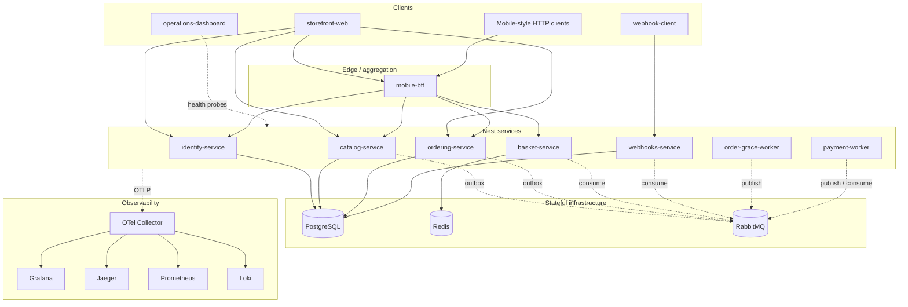
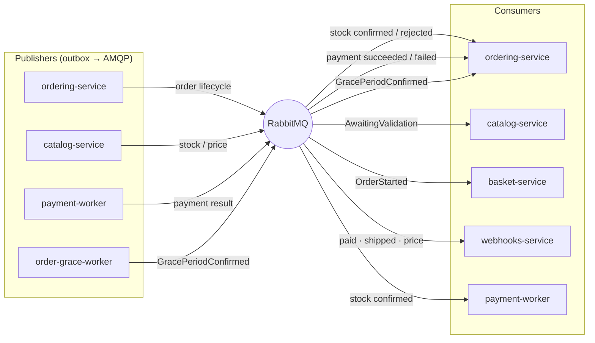
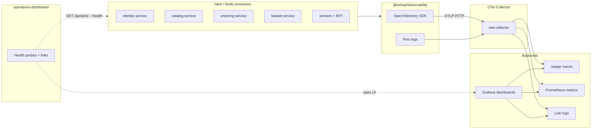

# NestJS Version of eShopOnContainers

I built this repository as a **personal study project**. It is inspired by Microsoft’s [dotnet/eShop](https://github.com/dotnet/eShop) sample and by the ideas in [Introducing the eShopOnContainers reference application](https://learn.microsoft.com/pt-br/dotnet/architecture/cloud-native/introduce-eshoponcontainers-reference-app) (bounded contexts, BFF gateways, database-per-service, integration events, and cloud-native practices).

**This is not an official Microsoft project**, and it is not maintained by the eShop authors. I am learning by re-implementing the same **concepts** on a stack I use every day: **NestJS**, **React**, **Prisma**, **PostgreSQL**, **Redis**, **RabbitMQ**, and **Docker Compose**. I do not aim for a line-by-line port of the .NET solution. Where it helped my learning, I kept the **interface** visually familiar—similar layout and stock images—while the UI is React and Tailwind, not Blazor.

> **Study-only defaults:** weak JWT secrets and optional auth bypass flags are intentional for local labs. Do not expose this stack to the public internet unchanged. See [SECURITY.md](SECURITY.md).

---

## Getting started

### Prerequisites

- Node.js 20.19+
- pnpm 9.x
- Docker Desktop with Compose v2 (Postgres, Redis, RabbitMQ, observability)

### Quick start (hybrid dev — what I use most)

```bash
cp .env.example .env
pnpm install
pnpm build
pnpm setup:local
pnpm dev
pnpm dev:ui
```

| Step | Command | What it does |
|------|---------|----------------|
| 1 | `cp .env.example .env` | Copies local environment variables (`ESHOP_*`, `VITE_*`). Do not commit real secrets. |
| 2 | `pnpm install` | Installs all workspace packages (apps, shared packages, tests). |
| 3 | `pnpm build` | Compiles infrastructure libraries, domain packages, Nest services, and web apps. |
| 4 | `pnpm setup:local` | Starts Docker infra (`infra:up`), then runs database migrations and seeds. |
| 5 | `pnpm dev` | Runs Nest APIs, workers, and the mobile BFF on the host with hot reload. |
| 6 | `pnpm dev:ui` | Runs the Vite frontends: storefront, webhook client, and operations dashboard. |

**Typical URLs (host-run)**

| App | URL |
|-----|-----|
| Storefront | http://127.0.0.1:5173 |
| Identity Swagger | http://127.0.0.1:5051/api/docs |
| Catalog Swagger | http://127.0.0.1:5052/api/docs |
| Ordering Swagger | http://127.0.0.1:5053/api/docs |
| Mobile BFF | http://127.0.0.1:5070/api/docs |
| Grafana | http://127.0.0.1:3200 |
| Jaeger | http://127.0.0.1:16686 |

**Seed login:** user `alice` (or `alicesmith@email.com`), password `Pass123$`.

### Other useful commands

| Command | Purpose |
|---------|---------|
| `pnpm infra:up` / `pnpm infra:down` | Start or stop Postgres, Redis, RabbitMQ, and the observability stack only. |
| `pnpm db:migrate` / `pnpm db:seed` | Apply Prisma migrations or re-seed databases. |
| `pnpm stack:up` / `pnpm stack:down` | Run Nest services and the storefront inside Docker (Compose `stack` profile). |
| `pnpm check` | Lint (Biome) plus full build — quick gate before a PR. |
| `pnpm ci` | Build, OpenAPI contract check, and the full test pipeline (Docker required). |
| `pnpm test:unit` | Unit and contract tests across packages and services. |
| `pnpm test:e2e` | Playwright E2E; optional suites skip when the stack is not running. |
| `pnpm contracts:check` | Validates committed OpenAPI snapshots. |
| `pnpm contracts:export-openapi` | Regenerates OpenAPI JSON (services must be running). |
| `pnpm lint` / `pnpm lint:fix` | Run Biome check or auto-fix. |

More detail: [deploy/compose/README.md](deploy/compose/README.md) · [tests/e2e/README.md](tests/e2e/README.md) · [contracts/README.md](contracts/README.md)

---

## Stacks

### Runtime and tooling

Node.js, TypeScript, pnpm workspaces, Biome, Docker Compose, concurrently, dotenv-cli

### Backend

NestJS, Express, Prisma, Passport JWT, class-validator, class-transformer, gRPC (basket), scheduled jobs, Swagger / OpenAPI

### Data and messaging

PostgreSQL, pgvector (catalog AI), Redis, RabbitMQ, AMQP integration events, transactional outbox, inbox ledger, idempotency keys

### Frontend

React, Vite, React Router, Tailwind CSS, shared UI kit (shadcn-style), class-variance-authority, optional OIDC (Keycloak)

### Observability

OpenTelemetry, Pino, Grafana, Prometheus, Jaeger, Loki, OTel Collector

### Testing

Vitest, Jest, Playwright, Testcontainers, axe (accessibility)

### Deploy and study paths

Docker, nginx, Helm, k3d, Argo CD, GitOps overlays, Keycloak (optional OIDC)

---

## Features

- Browse catalog items with brand and type filters
- View product details and pictures
- Add, edit, and remove cart items (session or server-backed basket when logged in)
- Register, sign in, and sign out (local JWT; optional Keycloak OIDC)
- Create order drafts and submit orders
- List and track order status
- Register webhook subscriptions and receive integration-event callbacks
- Mobile-style HTTP aggregation via the BFF
- Optional catalog AI embeddings and chat (feature-flagged)
- Operations dashboard for health probes and observability links

---

## Design patterns and architecture concepts

**Architecture**

- Monorepo with bounded contexts
- Microservices (one deployable per context)
- Database per service
- Layered / hexagonal layout inside each service (`api`, `application`, `infrastructure`, `integration`)
- Domain-driven design (pure domain packages without Nest or Prisma)
- Backend-for-frontend (mobile BFF as HTTP reverse proxy)
- API-first with versioned OpenAPI contracts

**Integration and consistency**

- Transactional outbox (publish after DB commit)
- Event-driven choreography (order saga over RabbitMQ)
- CQRS in ordering (commands and queries)
- Inbox / idempotency for safe message redelivery
- Integration events with a shared vocabulary (aligned with the reference eShop naming)

**Implementation patterns**

- Nest modules and dependency injection
- Repository ports and infrastructure adapters
- Command and query handlers
- DTOs with validation pipes
- Auth guards (JWT; optional dev bypass)
- Outbox publisher and AMQP consumers
- HTTP resilience (retries, timeouts)
- Strategy pattern for optional AI providers (catalog)
- Shared design system for React SPAs

---

## Repository layout (skeleton)

```
eShopOnContainers-NestJS/
├── apps/
│   ├── identity-service/
│   ├── catalog-service/
│   ├── ordering-service/
│   ├── basket-service/
│   ├── webhooks-service/
│   ├── order-grace-worker/
│   ├── payment-worker/
│   ├── mobile-bff/
│   ├── storefront-web/
│   ├── webhook-client/
│   └── operations-dashboard/
├── packages/
│   ├── domains/              # basket, catalog, identity, ordering
│   └── infrastructure/       # auth, event-bus, outbox, observability, ui, …
├── contracts/                # OpenAPI, gRPC, golden events, event catalog
├── deploy/                   # Compose, Dockerfiles, Helm, k3d, Keycloak, GitOps
├── tests/
│   ├── e2e/                  # Playwright
│   └── integration/          # Vitest + Testcontainers
├── tools/                    # OpenAPI export and contract checks
├── docs/                     # ADRs and architecture decision index
├── package.json
├── pnpm-workspace.yaml
├── .env.example
└── README.md
```

Inside each Nest service, `src/` is usually split into **api** (HTTP or gRPC), **application** (use cases), **infrastructure** (Prisma, Redis, etc.), and **integration** (AMQP consumers and outbox).

---

## Diagrams

### System architecture



### Event-driven flow

Order lifecycle continues asynchronously after Postgres commits (outbox → RabbitMQ → consumers).



Event matrix and sample payloads: [contracts/integration-events.md](contracts/integration-events.md)

### Observability

How telemetry and health checks fit together in local development.



Start observability with `pnpm infra:up` (Compose merge). Details: [deploy/compose/observability/README.md](deploy/compose/observability/README.md)

---

## Documentation

Architecture decisions (ADRs) and the docs index: **[docs/README.md](docs/README.md)**.

| ADR | Decision |
|-----|----------|
| [0001](docs/adr/0001-nestjs-typescript-study-reimplementation.md) | NestJS / TypeScript study reimplementation |
| [0002](docs/adr/0002-pnpm-monorepo-microservices.md) | pnpm monorepo and microservices |
| [0003](docs/adr/0003-database-per-service-prisma.md) | Database per service (Prisma) |
| [0004](docs/adr/0004-framework-free-domain-packages.md) | Framework-free domain packages |
| [0005](docs/adr/0005-transactional-outbox-rabbitmq-integration.md) | Outbox + RabbitMQ integration |
| [0006](docs/adr/0006-basket-redis-grpc-and-http.md) | Basket: Redis, gRPC, HTTP |
| [0007](docs/adr/0007-jwt-auth-optional-oidc.md) | JWT and optional OIDC |
| [0008](docs/adr/0008-openapi-contract-first.md) | OpenAPI contract-first |
| [0009](docs/adr/0009-mobile-bff-http-proxy.md) | Mobile BFF HTTP proxy |

---

## Further reading

| Topic | Location |
|-------|----------|
| Compose profiles and env | [deploy/compose/README.md](deploy/compose/README.md) |
| Full stack in Docker | [deploy/compose/README-stack.md](deploy/compose/README-stack.md) |
| E2E tests | [tests/e2e/README.md](tests/e2e/README.md) |
| Contracts and events | [contracts/README.md](contracts/README.md) |
| Security | [SECURITY.md](SECURITY.md) |
| Helm (study) | [deploy/helm/eshop-nestjs/README.md](deploy/helm/eshop-nestjs/README.md) |
| Keycloak OIDC | [deploy/keycloak/README.md](deploy/keycloak/README.md) |

---

## License

[MIT](LICENSE) — see [NOTICE](NOTICE) for third-party attributions where applicable.
